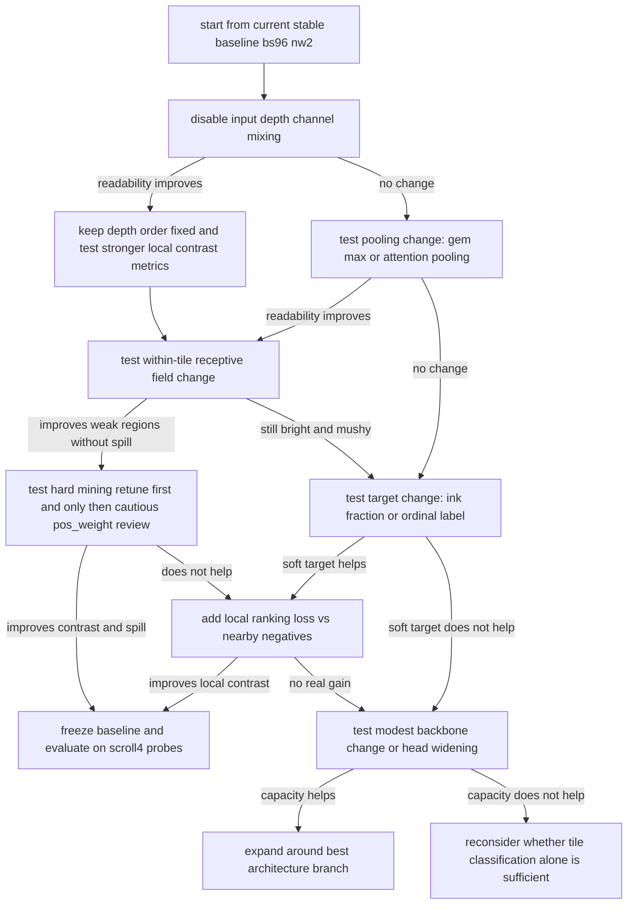

# Future Direction Notes

Last updated: 2026-06-08

This file is the main handoff point for future agents.

Current implementation note:

- readability-oriented B metrics have begun implementation in `utils/visualizer.py`
- scalar readability metrics log under `R_M/*`
- fixed probe-region figures log under `ProbeROIs/*`
- current probe set is intentionally cheap: easy / hard on small scroll 1 and the target pi region on scroll 4

## 1. Project Thesis

The core thesis of this repo is still good:

- avoid the full computational cost of a U-Net-style dense pixel reconstruction model
- instead, classify a small 3D tile from the zarr volume as "contains any ink" vs "contains no ink"
- aggregate tile scores into a readable 2D heatmap

The problem is that the current objective and current metrics reward a behavior that is only loosely connected to readable output. That makes it easy to improve F1, PR-AUC, or histogram shape while still making the resulting image brighter, mushier, or more globally positive instead of more letter-like.

Put differently:

- the model is solving the training target better than it is solving the actual human goal
- the human goal is readable contrast in plausible ink regions, especially weak regions
- the current target is binary tile presence under weak labels

## 2. What The Code Currently Does

### 2.1 Input unit and data geometry

Current training sample:

- one 3D block of shape `(depth, tile_size, tile_size)`
- current defaults in code: `depth=8`, `tile_size=32`
- model input shape after channel dimension: `(1, 8, 32, 32)`

This means the model sees exactly an `8 x 32 x 32` block.
These were created manually by the user.

Important consequence:

- the classifier has no explicit supervision for *where* ink is inside the tile
- it only learns whether *any* ink is present anywhere in the tile

### 2.2 Depth handling

Current defaults in [utils/config.py](utils/config.py):

- `d_start=28`
- `d_end=48`
- `depth=8`

In the dataset/eval code, this effectively yields overlapping depth windows with step `depth // 2 = 4`.

For the current default range, the model is effectively trained and evaluated on four overlapping depth windows:

- 28-36
- 32-40
- 36-44
- 40-48

This is a reasonable compressed depth strategy.

### 2.3 Label construction

Tile label rule in [utils/dataloader.py](utils/dataloader.py):

- take the `32 x 32` label tile from `eroded_inklabels`
- if *any* pixel in that tile is above threshold, the whole tile label is positive

This is the single most important design choice in the current system.

It makes the task simple and cheap.

It also creates an unavoidable ambiguity:

- a tile with one tiny faint positive region
- and a tile with a broad, obvious stroke footprint

both receive the exact same target: `1`

That heavily weakens the connection between classification quality and readability quality.

### 2.4 Normalization

Normalization is per-segment and mask-aware.

In [utils/dataloader.py](utils/dataloader.py):

- compute mean and std over valid masked pixels only
- z-score normalize
- then scale to `[0, 1]` using normalized global min/max
- cache values in `norm_cache.json`

This is good and likely not the main reason for the plateau.

Normalization is already more careful than many quick baselines.

### 2.5 Data augmentation

Current augmentations in `Transform` in [utils/dataloader.py](utils/dataloader.py):

- random channel mixing
- random 90/180/270 rotation
- random flips
- gaussian noise
- brightness perturbation
- contrast perturbation

Augmentations activate only after epoch 5.

Important note:

- random channel mixing is potentially dangerous here
- this is not an RGB image where channels are unordered feature maps
- the input depth slices correspond to physical depth ordering inside the scroll
- forcing permutation invariance across input depth may destroy one of the most valuable cues in the volume

This is one of the highest-priority ablations to run.

### 2.6 Train/valid split

In [utils/dataloader.py](utils/dataloader.py), `DataManager._load_raw_data()` currently:

- loads one segment volume
- uses the full height and width
- splits only along `x` with a 75/25 split into train/valid

For the small scroll segment, the visualizer uses a special-case crop for its eval figures in [utils/visualizer.py](utils/visualizer.py):

- `y = 200..5600`
- `x = 1000..4600`
- then split that x-range 75/25 for figure generation

This means there is a mild mismatch between:

- the actual training/validation dataset split used for loss/metrics
- the cropped region used for some evaluation figure generation on the small scroll

That is not necessarily catastrophic, but it does make interpretation less clean.

### 2.7 Model architecture

Current model in [utils/model.py](utils/model.py):

- 3D conv stack with channels `1 -> 32 -> 128 -> 256`
- CBAM3D attention after each major conv stage
- two `MaxPool3d` stages
- final `AdaptiveAvgPool3d(1)`
- MLP head: `256 -> 512 -> 256 -> 128 -> 64 -> 32 -> 1`

Important architectural fact:

- the model ends with **global average pooling** over the final 3D feature volume

This is probably the second most important design choice after the label rule.

Why it matters:

- sparse weak ink is likely a small localized signal
- global average pooling encourages the representation to summarize the whole tile
- that can reward broad low-contrast positive evidence instead of sharply localized evidence
- in practice, that is exactly compatible with the observed behavior: better scalar metrics but brighter, blurrier outputs

The head is not actually an NLP head. It is an MLP classifier head.

That matters because if the representation entering the head has already averaged away localized sparse evidence, widening the head alone is unlikely to solve the real problem.

### 2.8 Loss and optimization

Current training details from [train.py](train.py) and [utils/training_utils.py](utils/training_utils.py):

- BCEWithLogitsLoss
- positive class weight estimated from sampled dataset labels
- masked loss
- L1 regularization with `l1_lambda = 7e-6`
- AdamW
- warmup then ReduceLROnPlateau scheduler
- gradient clipping `0.5`
- AMP enabled

Observed sampled class ratio on small segment:

- positive weight about `7.66`

This is plausible, but note what it does in combination with binary any-ink labels:

- it pushes the model to avoid missing positives
- the cheapest way to avoid missing positives under ambiguous labels is often to raise scores more broadly
- that creates exactly the observed "ink spillout" behavior

### 2.9 Hard negative mining

Current hard mining in [utils/visualizer.py](utils/visualizer.py) and [utils/hard_mining.py](utils/hard_mining.py):

- every `eval_int=20`, the visualizer runs evaluation figures and writes `hard_negs/hard_mining_epoch_<epoch>.jsonl`
- hard negatives: negative tiles with score >= `0.8`
- hard positives: positive tiles with score <= `0.45`
- later epochs load and inject a sampled subset of those tiles into training

Important notes:

- mined examples are sourced from evaluation over the training side tiles, not from a fundamentally new objective
- hard mining is still downstream of the same binary tile label rule
- so it mostly sharpens pressure inside the same misaligned task

This is why hard mining can improve classifier metrics without meaningfully improving readability.

### 2.10 Current logged metrics

Current TensorBoard logging in [utils/visualizer.py](utils/visualizer.py):

- train/valid loss
- accuracy
- precision
- recall
- F1
- specificity
- ROC-AUC
- PR-AUC
- confusion matrix figure
- output histogram figure
- metrics comparison bar/radar chart
- weight and gradient histograms
- evaluation figures every `eval_int`
- test figures every `test_int`

Current cadence:

- evaluation figures every 20 epochs
- full test / scroll4 figures every 50 epochs

That means the most human-meaningful qualitative signal is relatively sparse.

## 3. What Is Already Being Tried

The current system is not naive. Several real improvement steps are already present:

- per-segment masked normalization
- eroded labels to reduce supervision spillover
- mixed precision and gradient clipping
- heavy metric logging
- hard negative / hard positive mining
- multi-depth evaluation figures
- scroll4 holdout visualization path

So the current plateau should not be interpreted as "more logging" or "slightly more data" being the missing ingredient.

The likely bottleneck is structural.

## 4. Why Current Metrics Fail The Actual Goal

### 4.1 They are tile-level, not readability-level

The current metrics tell you how well the model classifies tiles.

They do **not** tell you whether the final heatmap is readable as text.

This is the core problem.

Possible failure case:

- a model raises positive scores on true positive tiles
- but also raises scores on a broad halo of nearby background tiles
- F1 may improve
- PR-AUC may improve
- the image becomes brighter and less readable

That is exactly the observed failure mode.

### 4.2 F1 rewards thresholded correctness, not local contrast

Readable output requires:

- positives to be high relative to nearby negatives
- background to stay dark enough that letters separate from surroundings
- weak positives to emerge locally, not just globally

F1 does not directly measure any of that.

### 4.3 Histogram bimodality is not the right north star

The desire for two distinct peaks in the output histogram is understandable.

But in this task it is not necessarily the right goal.

Reasons:

- labels are weak and noisy
- many tiles are ambiguous or partially positive
- some positive tiles contain faint, partial, or uncertain evidence
- the true score distribution may be broad, not cleanly bimodal

Forcing stronger separation can easily produce binary slush:

- confident positives everywhere
- confident negatives everywhere else
- no nuanced structure in between

So histogram separation is not useless, but it is a poor primary metric.

### 4.4 Confusion matrix is global and dominated by easy negatives

Most tiles are easy background.

A confusion matrix aggregated over all tiles can look better while the model still fails exactly where it matters:

- weak strokes
- missing letters
- uncertain regions
- faint ink regions near plausible text

This makes the current confusion matrix only weakly actionable.

### 4.5 Current metrics do not isolate the hard regions you actually care about

You care about:

- weak positives
- missing letters in known words
- faint but plausible ink
- better behavior on the holdout / target-like regions

Current logged metrics are not stratified by difficulty.

That means you can improve the easy majority while learning nothing about the rare regions that matter.

## 5. Main Hypothesis About The Plateau

The most likely explanation is not "the model is too small" in a generic sense.

The most likely explanation is:

1. the label target is too coarse
2. the pooling strategy is too averaging-heavy for sparse evidence
3. the positive weighting and mining encourage recall through global brightening
4. the metrics reward tile classification quality more than readable local contrast

In other words:

- the model is not obviously under-optimized
- it is optimized toward the wrong proxy

## 6. Concrete Shortcomings Of The Current Model

### 6.1 Any-ink tile labels discard ink amount and location

This is likely the biggest issue.

Current target says:

- one faint pixel inside a `32x32` tile = same target as a large clean stroke footprint

That encourages the model to learn a generic "some positive texture may exist here" score, not a sharp text-preserving score.

### 6.2 Adaptive average pooling is probably washing out sparse signals

Global average pooling is efficient, but it is a very blunt summary operator.

If the true signal is tiny and sparse, average pooling is often exactly the wrong inductive bias.

It is compatible with blur.

### 6.3 Random input depth channel mixing may be harming the real signal

This augmentation assumes depth ordering is not important.

That is unlikely to be true.

This may actively teach the model to ignore depth-specific stroke evidence.

### 6.4 Positive weighting may be over-solving recall by lifting the score floor

`pos_weight ~ 7.66` can still encourage a global upward bias under coarse labels.

That creates:

- brighter outputs
- more false-positive haze
- weak improvement in readability

Important user clarification:

- `7.66` is intentional
- it is based on the background/ink ratio averaged across the available scrolls
- in the current implementation it acts partly like a brightness modifier
- do not change it casually

Interpretation:

- `pos_weight` is now a lower-priority tuning axis than pooling, target design, and readability-oriented evaluation
- revisit it only after structural changes are tested, or if the new readability metrics strongly justify it

### 6.5 Hard mining is optimizing the same misaligned task harder

Hard mining is useful only if the base objective is aligned enough.

Here, it may just be emphasizing the same label ambiguity.

### 6.6 The model has no explicit reason to preserve local contrast

Nothing in the current loss says:

- keep nearby background dark
- rank true positives above matched local negatives
- prefer compact confident positive islands over broad haze

That missing pressure is likely why the model keeps converging to brightness instead of readability.

## 7. Shortcomings Of Current Evaluation

### 7.1 Full inference cadence is intentionally sparse

Current `test_int=50` means the full test / scroll4 qualitative output appears only every 50 epochs.

Important user clarification:

- this sparsity is intentional, not an oversight
- epoch 50 is currently serving as an end-of-training or slight-overtraining diagnostic point
- full test / scroll4 inference is expensive enough that it should not be made frequent by default

Practical implication:

- if earlier qualitative feedback is needed, the preferred first move is to shorten `n_epochs` for a given experiment or lean on the cheap probe-region figures
- do not assume the right answer is simply lowering `test_int`

### 7.2 No explicit weak-region benchmark exists

There should be a fixed set of tiny benchmark regions for:

- known easy positive strokes
- known weak positive strokes
- known troublesome missing-letter zones
- matched nearby non-ink background

Right now, those regions are not first-class tracked assets.

Update:

- this is no longer purely hypothetical
- a first probe set is now integrated into `utils/visualizer.py`
- current probes are:
  - easy region on small scroll 1
  - hard region on small scroll 1
  - target pi region on scroll 4

### 7.3 Metrics are not anchored to low-false-positive behavior

Readable text extraction requires very strong background suppression.

Metrics like full ROC-AUC can look fine while behavior in the low-FPR regime is still unacceptable.

## 8. Hypotheses For What Will Improve Performance

This section is deliberately prioritized.

### Priority A1: Remove or ablate random input depth channel mixing

Why:

- depth order likely matters physically
- current augmentation may destroy a useful cue

Expected outcome if this hypothesis is right:

- similar or slightly lower generic metric movement at first
- better local contrast in evaluation figures
- weak regions become less smeared

If it helps:

- keep it disabled permanently
- consider replacing it with weaker depth jitter instead of full permutation

### Priority A2: Replace global average pooling with a sparse-evidence pooling strategy

Candidates:

- GeM pooling
- max pooling
- attention pooling
- top-k pooling over spatial locations

Why:

- the current model likely averages sparse signal away
- readable detection wants the representation to respond strongly to localized evidence

Expected outcome if this hypothesis is right:

- positive tiles become more contrastive without needing a global brightness lift
- weak positives are more likely to stand out against local background

This is the most important architectural change that still preserves the spirit of the project.

### Priority A3: Increase within-tile receptive field without violating the 32x32 rule

Larger-than-`32x32` patches are disallowed by the competition and should not be tested.

So the replacement branch is:

- keep the input strictly `32x32`
- increase effective receptive field inside the legal tile instead of increasing patch size

Candidate directions:

- dilated convolutions
- mixed kernel sizes inside the same stage
- anisotropic kernels across depth vs spatial axes
- lightweight multi-branch feature extraction before pooling

Why this still matters:

- the model still needs a better way to collect sparse local evidence inside the legal tile size
- this preserves the competition rule while still testing whether the current feature extractor is too blunt

### Priority A4: Change the target from binary any-ink to soft ink amount or ordinal presence

Possible alternatives:

- predict fraction of ink pixels in tile
- predict ordinal bins such as none / weak / medium / strong
- keep binary head but add auxiliary regression head for ink fraction

Why:

- current binary target collapses too much information
- a soft target gives the model a reason to distinguish faint from obvious positive tiles

Expected outcome:

- smoother and more meaningful score gradients
- less pressure to call every ambiguous tile strongly positive

This is probably the single best objective-level improvement if you want to stay away from a full segmentation model.

### Priority A5: Replace pure BCE focus with a ranking or local-contrast-aware term

Examples:

- positive-vs-nearby-negative ranking loss
- focal / asymmetric loss as an ablation
- loss term that rewards positives outranking local background tiles

Why:

- readability is fundamentally about local score separation, not just binary tile correctness

The most interesting option is not generic focal loss. It is a local ranking loss.

For each positive tile, compare it against sampled neighboring negative tiles and enforce a margin.

That directly attacks the "brighter everywhere" failure mode.

### Priority A6: Revisit positive weighting and hard-mining thresholds together

Current ingredients:

- `pos_weight ~ 7.66`
- hard negative cutoff `0.8`
- hard positive cutoff `0.45`

Hypothesis:

- the system may be over-correcting toward recall and positive sensitivity
- this can increase spillout without helping weak-region recall where it matters

High-value ablations:

- lower hard-mining fraction
- restrict hard-positive mining to curated weak-positive zones
- compare no-hard-mining vs hard-mining under the new readability metrics

Additional note:

- `pos_weight` sweeps are now secondary and should be approached carefully because the current value is user-chosen intentionally

### Priority A7: Curate difficulty-specific training and validation sets

Instead of only relying on the whole scroll split:

- define a weak-positive benchmark set
- define a matched hard-negative set near plausible text
- define a known-missing-letter probe set where human expectation is strong

This should not replace the main dataset.

It should become a first-class diagnostic asset.

### Priority A8: Only later, widen the head or deepen the model

Widening the linear head or adding more channels may help only if representation capacity is the real bottleneck.

Right now, that does not look like the first bottleneck.

I would treat head-size expansion as a lower-priority branch, not the first move.

## 9. Metrics Better Aligned With Readability

Below are metrics that are more actionable for this project than plain global F1.

### B1: Local contrast score

For each positive tile or positive region:

- measure mean positive score
- subtract mean score of a local ring or nearby matched negatives

This directly measures whether the model is separating text from its surroundings.

This is much closer to readability than global F1.

### B2: Positive-vs-nearby-negative ranking accuracy

For each positive tile:

- sample nearby negative tiles from the same local neighborhood
- measure how often the positive tile outranks those negatives

This is a strong candidate for a primary metric.

Readable maps need local ranking, not just global correctness.

### B3: Recall at very low false-positive rate

Track:

- recall at fixed very low FPR
- partial AUC in the low-FPR regime

Because background suppression matters so much, this is much more informative than full ROC-AUC.

### B4: Top-k precision / precision at ink budget

Choose `k` based on:

- number of positive tiles in the region
- or a fixed annotation-driven ink budget

Then ask:

- if we only keep the top-k brightest tiles, how pure are they?

This is often far closer to how humans use these maps.

### B5: Tile ink-fraction correlation

If you compute the fraction of positive label pixels per tile:

- track correlation between score and fraction
- or train on that target directly

This tests whether scores reflect real ink density rather than just binary presence.

### B6: Connected-component compactness / spill metric

Compute simple spatial diagnostics on thresholded predictions:

- number of connected components
- component size distribution
- fraction of positive mass outside a dilated GT mask
- ratio of in-mask to out-of-mask positive area

This can explicitly quantify slush and spillout.

### B7: Fixed probe-region scorecards

Create a small set of benchmark ROIs:

- easy word fragment
- weak known-positive fragment
- matched no-ink region
- suspicious region on scroll4

For each ROI log:

- mean score
- local contrast
- top-k precision
- qualitative snapshot every few epochs

This should become a first-class dashboard.

### B8: Readability proxy, not just classification proxy

A practical composite proxy could be:

- local contrast score
- spill penalty
- low-FPR recall
- weak-region probe score

This composite would be more faithful to the actual visual goal than F1 alone.

## 10. Recommended Experiment Order

The order matters.

Do not start with ten changes at once.

### Stage 1: Fix the easiest likely harms

1. Remove random input depth channel mixing
2. Re-test the best current configuration
3. Track local-contrast and probe-region metrics, not just F1

Reason:

- cheap
- low-risk
- highly plausible improvement

### Stage 2: Improve pooling and within-tile receptive field while keeping the project simple

1. Replace adaptive average pooling with GeM / max / attention pooling
2. Increase within-tile receptive field while keeping the legal `32x32` input

Reason:

- these directly target sparse localized evidence
- still much simpler than a full U-Net

### Stage 3: Fix the target

1. Add auxiliary ink-fraction prediction
2. Or move to ordinal tile labels
3. Or keep binary head plus ranking term against local negatives

Reason:

- this directly addresses the main proxy mismatch

### Stage 4: Re-tune class balance and mining only after the above

1. Pos-weight sweep
2. Hard-mining threshold sweep
3. Hard-mining fraction sweep
4. Compare with and without hard mining under readability metrics

### Stage 5: Only then test bigger classifier heads or wider backbones

Because by that point you will know whether capacity is really the issue.

## 11. Decision Tree For Future Tests

## 12. Concrete Test Menu

These are the specific tests I would queue.

### Test 1: Ablate channel mixing

Change:

- remove `_apply_channel_mixing` from augmentation

Success criteria:

- better local-contrast metric
- cleaner weak-region qualitative output
- no major degradation in stable metrics

If successful:

- keep disabled permanently
- replace with tiny depth jitter only if needed

### Test 2: Pooling ablation

Compare:

- adaptive average pooling
- GeM pooling
- max pooling
- attention pooling / top-k pooling

Success criteria:

- better weak-region separation
- less global brightening
- better positive-vs-nearby-negative ranking

### Test 3: Within-tile receptive-field ablation

Compare:

- current `8x32x32` feature extractor
- dilated or multi-branch variants that keep the same legal input size

Success criteria:

- better weak-letter recovery
- better holdout readability
- no large spill penalty

### Test 4: Soft-target ablation

Compare:

- binary any-ink label
- tile ink fraction regression
- ordinal classes such as none / trace / light / strong

Success criteria:

- scores reflect confidence more meaningfully
- less pressure toward positive haze

### Test 5: Local ranking loss

Add:

- margin loss that forces positives to outrank nearby negatives

Success criteria:

- improved local contrast without needing higher global score floor

### Test 6: Pos-weight sweep

This is now a guarded test, not an early test.

Compare:

- no pos_weight
- moderate pos_weight
- sampled current pos_weight

Success criteria:

- best tradeoff of recall vs spill under local metrics

### Test 7: Hard-mining sweep

Compare:

- no hard mining
- current hard mining
- reduced hard-mining fraction
- harder negative-only emphasis

Success criteria:

- improved weak-region ranking without broad spillout

### Test 8: Head-size sweep only if upstream changes show promise

Compare:

- current head
- slightly wider head
- slightly shallower head

Reason:

- if pooling and target are fixed first, head capacity becomes a more meaningful test

## 13. What I Would *Not* Prioritize First

### Not first: just more data

You already tried significantly more data and saw the same failure mode.

That strongly suggests the bottleneck is not raw sample count.

### Not first: bigger MLP head alone

If the representation is already over-averaged, a larger head is unlikely to magically recover local sparse evidence.

### Not first: chasing histogram bimodality

This is too indirect and too easy to game with slush.

### Not first: jumping immediately to a U-Net

That would abandon the central hypothesis before fully testing the simpler path.

The simpler path still has several strong untested upgrades available.

## 14. Scroll Strategy Going Forward

Given the current project goal:

- use the labeled scroll 1 sections as the training and diagnostic base
- use the small scroll 1 section as a fast iteration environment
- keep the large scroll 1 section available if you need broader robustness checks
- treat scroll 4 as the main qualitative target and holdout-style probe target unless clean labels are available

For near-term experimentation, the small labeled section is probably enough to tell whether the objective/architecture change is directionally correct.

If a change does not improve weak-region behavior there, scaling it to more data is unlikely to help.

## 15. Practical Interpretation Of Current Failure Mode

The current model is behaving like a classifier that has discovered a cheap path:

- raise confidence over broad ambiguous areas
- catch more positives under a weak any-ink target
- accept some broad spill because the loss does not punish readability loss directly

That is why:

- F1 can go up
- output histogram can shift
- the image can still become less readable

This is not a random failure.

It is exactly what the current setup allows.

## 16. Strongest Current Hypothesis

If only one concise thesis is preserved from this file, preserve this one:

The project is most likely bottlenecked by **objective mismatch plus over-averaging**, not by lack of raw data and not primarily by lack of metric quantity.

The best next moves are therefore:

1. stop destroying depth order with channel mixing
2. stop averaging sparse evidence so aggressively
3. give the model either a better within-tile receptive field or a softer target
4. evaluate with local contrast and low-FPR metrics instead of relying on global F1

## 17. Minimal Recommended Baseline Branch

If a future agent needs the safest high-value branch to explore first, use this:

1. current stable training runtime baseline
2. disable channel mixing
3. add local contrast / local ranking metrics
4. swap adaptive average pooling for GeM or attention pooling
5. test within-tile receptive-field changes that preserve the `32x32` rule
6. then test soft tile targets

That branch stays true to the original philosophy of the project:

- simple
- tile-based
- much cheaper than dense U-Net reconstruction

while still addressing the most likely reasons the current classifier plateaus.

## 18. Code Surface Map For Future Agents

Main files that matter for the next stage:

- [train.py](train.py)
  - training loop
  - epoch cadence
  - optimizer/scheduler integration
  - augmentation activation timing

- [utils/dataloader.py](utils/dataloader.py)
  - tile generation
  - label rule
  - normalization
  - augmentation
  - train/valid split

- [utils/model.py](utils/model.py)
  - conv backbone
  - CBAM blocks
  - pooling choice
  - classifier head

- [utils/visualizer.py](utils/visualizer.py)
  - current metrics
  - evaluation figures
  - test figures
  - hard-mining generation

- [utils/hard_mining.py](utils/hard_mining.py)
  - hard-sample loading / sampling / injection

- [runs.md](runs.md)
  - Windows runtime notes
  - current stable dataloader settings

## 19. Final Note

The current results do not mean the simple 3D tile-classification idea failed.

They mean the current *version* of that idea is still too tied to a coarse binary target and overly global summary behavior.

There is still a meaningful path forward before conceding to a fully dense segmentation architecture.

But the next gains are much more likely to come from:

- changing what the model is asked to care about
- changing how the model aggregates sparse evidence
- changing how success is measured

than from simply training longer, mining harder, or adding more scalar metrics.

## 20. Automated Campaign Log (readability_2026_06_08)

- campaign started with automated sequential 30-epoch tests on small scroll 20230827161847

- 2026-06-09 09:24:44 UTC | test 01 t01_baseline_probe1 | readability_last=0.3715526759624481 | probe_easy=0.5491999983787537 | probe_hard=0.35394230484962463 | next=02:t02_no_channel_mix

- 2026-06-09 15:04:55 UTC | test 02 t02_no_channel_mix | readability_last=0.39386186003685 | probe_easy=0.5472447872161865 | probe_hard=0.34306973218917847 | next=03:t03_low_channel_mix

- 2026-06-10 00:31:01 UTC | test 03 t03_low_channel_mix | readability_last=0.3582670986652374 | probe_easy=0.5383473038673401 | probe_hard=0.3090948462486267 | next=04:t04_pool_max

- 2026-06-10 01:38:16 UTC | test 04 t04_pool_max failed rc=1 | next=05:t05_pool_gem_p3

- 2026-06-10 03:33:19 UTC | test 05 t05_pool_gem_p3 | readability_last=0.34783729910850525 | probe_easy=0.5326962471008301 | probe_hard=0.31150734424591064 | next=07:t07_no_mix_gem

- 2026-06-10 04:39:40 UTC | test 07 t07_no_mix_gem failed rc=1 | next=08:t08_conv3_dil2

- 2026-06-10 06:30:05 UTC | test 08 t08_conv3_dil2 | readability_last=0.35754403471946716 | probe_easy=0.5450989007949829 | probe_hard=0.3685373067855835 | next=10:t10_hm_off

- 2026-06-10 08:16:14 UTC | test 10 t10_hm_off | readability_last=0.36704951524734497 | probe_easy=0.5684111714363098 | probe_hard=0.39762693643569946 | next=11:t11_hm_frac_002

- 2026-06-10 09:06:52 UTC | test 11 t11_hm_frac_002 failed rc=1 | next=09:t09_conv3_dil2_gem

- 2026-06-10 10:50:32 UTC | test 12 t12_hn_cut_090 | readability_last=0.36344605684280396 | probe_easy=0.563590943813324 | probe_hard=0.3597739040851593 | next=13:t13_hn_cut_070

- 2026-06-10 12:29:23 UTC | test 13 t13_hn_cut_070 | readability_last=0.3760392963886261 | probe_easy=0.5590817928314209 | probe_hard=0.380943238735199 | next=14:t14_hp_cut_035

- 2026-06-10 14:17:51 UTC | test 14 t14_hp_cut_035 | readability_last=0.3688986599445343 | probe_easy=0.5684157013893127 | probe_hard=0.3556252121925354 | next=15:t15_hp_cut_055

## ## Automated Campaign Log (arch_search_2026_06_10)

- architecture search campaign started
- 2026-06-10 15:40:46 UTC | arch=v2_slim_head failed rc=1 | next=02:t02_no_cbam
- 2026-06-10 16:22:08 UTC | arch=v2_slim_head | readability_last=0.3325617015361786 | probe_easy=0.46673303842544556 | probe_hard=0.3117430508136749 | next=02:t02_no_cbam
- 2026-06-10 16:56:00 UTC | arch=v2_no_cbam | readability_last=0.3180636167526245 | probe_easy=0.44113242626190186 | probe_hard=0.327772855758667 | next=05:t05_residual
- 2026-06-10 17:59:10 UTC | arch=v2_slim_head | readability_last=0.36123529076576233 | probe_easy=0.516002893447876 | probe_hard=0.30766424536705017 | next=02:t02_no_cbam
- 2026-06-10 19:00:40 UTC | arch=v2_slim_head | readability_last=0.3583658039569855 | probe_easy=0.5033379793167114 | probe_hard=0.32816827297210693 | next=02:t02_no_cbam
- 2026-06-10 19:25:39 UTC | arch=v2_no_cbam | readability_last=0.3439983129501343 | probe_easy=0.45745721459388733 | probe_hard=0.33790063858032227 | next=05:t05_residual
- 2026-06-10 21:33:19 UTC | arch=v2_residual | readability_last=0.3671565353870392 | probe_easy=0.538194477558136 | probe_hard=0.33517420291900635 | next=06:t06_residual_no_cbam
- 2026-06-11 00:25:59 UTC | arch=v2_residual_no_cbam | readability_last=0.38947218656539917 | probe_easy=0.533713698387146 | probe_hard=0.327567458152771 | next=07:t07_bottleneck
- 2026-06-11 01:00:28 UTC | arch=v2_bottleneck | readability_last=0.3672417104244232 | probe_easy=0.5214803814888 | probe_hard=0.2905004918575287 | next=08:t08_preact_res
- 2026-06-11 01:49:38 UTC | arch=v2_preact_res | readability_last=0.39589226245880127 | probe_easy=0.5143392086029053 | probe_hard=0.331453800201416 | next=09:t09_wider_shallow
- 2026-06-11 03:07:28 UTC | arch=v2_wider_shallow failed rc=1 | next=10:t10_slim_all
- 2026-06-11 03:10:07 UTC | arch=v2_slim_all failed rc=1 | next=11:t11_deeper
- 2026-06-11 03:38:11 UTC | arch=v2_deeper | readability_last=0.3658023774623871 | probe_easy=0.5286292433738708 | probe_hard=0.3292204439640045 | next=12:t12_factorized_depth
- 2026-06-11 03:38:41 UTC | arch=v2_factorized_depth failed rc=1 | next=13:t13_asymmetric_first
- 2026-06-11 04:05:01 UTC | arch=v2_asymmetric_first | readability_last=0.3522029221057892 | probe_easy=0.5046372413635254 | probe_hard=0.319334477186203 | next=14:t14_strided_conv
- 2026-06-11 04:08:43 UTC | arch=v2_strided_conv failed rc=1 | next=15:t15_dual_pool
- 2026-06-11 04:39:38 UTC | arch=v2_dual_pool failed rc=1 | next=16:t16_group_norm
- 2026-06-11 05:00:37 UTC | arch=v2_group_norm | readability_last=0.3136395514011383 | probe_easy=0.43343716859817505 | probe_hard=0.33525943756103516 | next=18:t18_depth_project
- 2026-06-11 05:20:08 UTC | arch=v2_depth_project | readability_last=0.32897841930389404 | probe_easy=0.4560369849205017 | probe_hard=0.34989169239997864 | next=03:t03_se_only
- 2026-06-11 05:37:47 UTC | arch=v2_se_only | readability_last=0.3516099154949188 | probe_easy=0.5106854438781738 | probe_hard=0.3324577808380127 | next=04:t04_eca
- 2026-06-11 05:59:13 UTC | arch=v2_eca | readability_last=0.36237865686416626 | probe_easy=0.4989055097103119 | probe_hard=0.36170288920402527 | next=19:t19_two_stream

## ## Automated Campaign Log (arch_search3_2026_06_10)

- campaign 3 started
- 2026-06-11 06:12:50 UTC | arch=v3_preact_baseline | readability_last=None | probe_hard=None | next=02:t02_preact_deep
- 2026-06-11 06:12:50 UTC | arch=v3_preact_deep | readability_last=None | probe_hard=None | next=03:t03_res_no_cbam_deep
- 2026-06-11 06:12:50 UTC | arch=v3_res_no_cbam_deep | readability_last=None | probe_hard=None | next=04:t04_deeper_no_cbam
- 2026-06-11 06:12:50 UTC | arch=v3_deeper_no_cbam | readability_last=None | probe_hard=None | next=05:t05_preact_deep_3pool
- 2026-06-11 06:12:50 UTC | arch=v3_preact_deep_3pool | readability_last=None | probe_hard=None | next=06:t06_depth_attn
- 2026-06-11 06:12:50 UTC | arch=v3_depth_attn | readability_last=None | probe_hard=None | next=07:t07_depth_squeeze
- 2026-06-11 06:12:50 UTC | arch=v3_depth_squeeze | readability_last=None | probe_hard=None | next=08:t08_fpn
- 2026-06-11 06:12:50 UTC | arch=v3_fpn | readability_last=None | probe_hard=None | next=09:t09_multiscale_pool
- 2026-06-11 06:12:50 UTC | arch=v3_multiscale_pool | readability_last=None | probe_hard=None | next=10:t10_nonlocal
- 2026-06-11 06:12:50 UTC | arch=v3_nonlocal | readability_last=None | probe_hard=None | next=11:t11_spatial_attn_pool
- 2026-06-11 06:12:50 UTC | arch=v3_spatial_attn_pool | readability_last=None | probe_hard=None | next=12:t12_preact_gem
- 2026-06-11 06:12:50 UTC | arch=v3_preact_gem | readability_last=None | probe_hard=None | next=13:t13_preact_dual_pool
- 2026-06-11 06:12:50 UTC | arch=v3_preact_dual_pool | readability_last=None | probe_hard=None | next=14:t14_preact_asym
- 2026-06-11 06:12:50 UTC | arch=v3_preact_asym | readability_last=None | probe_hard=None | next=15:t15_dilated_preact
- 2026-06-11 06:12:50 UTC | arch=v3_dilated_preact | readability_last=None | probe_hard=None | next=16:t16_preact_bottleneck
- 2026-06-11 06:12:50 UTC | arch=v3_preact_bottleneck | readability_last=None | probe_hard=None | next=17:t17_preact_eca
- 2026-06-11 06:12:50 UTC | arch=v3_preact_eca | readability_last=None | probe_hard=None | next=18:t18_instance_norm
- 2026-06-11 06:12:50 UTC | arch=v3_instance_norm | readability_last=None | probe_hard=None | next=19:t19_preact_wide
- 2026-06-11 06:12:50 UTC | arch=v3_preact_wide | readability_last=None | probe_hard=None | next=20:t20_res_no_cbam_v2_clean
- 2026-06-11 06:12:50 UTC | arch=v2_residual_no_cbam | readability_last=None | probe_hard=None | next=none
- 2026-06-11 06:16:16 UTC | arch=v2_two_stream | readability_last=0.2875801920890808 | probe_easy=0.41064974665641785 | probe_hard=0.30742567777633667 | next=17:t17_no_norm_drop
- 2026-06-11 06:16:50 UTC | arch=v3_preact_baseline | readability_last=None | probe_hard=None | next=02:t02_preact_deep
- 2026-06-11 06:16:50 UTC | arch=v3_preact_deep | readability_last=None | probe_hard=None | next=03:t03_res_no_cbam_deep
- 2026-06-11 06:16:50 UTC | arch=v3_res_no_cbam_deep | readability_last=None | probe_hard=None | next=04:t04_deeper_no_cbam
- 2026-06-11 06:16:50 UTC | arch=v3_deeper_no_cbam | readability_last=None | probe_hard=None | next=05:t05_preact_deep_3pool
- 2026-06-11 06:16:50 UTC | arch=v3_preact_deep_3pool | readability_last=None | probe_hard=None | next=06:t06_depth_attn
- 2026-06-11 06:16:50 UTC | arch=v3_depth_attn | readability_last=None | probe_hard=None | next=07:t07_depth_squeeze
- 2026-06-11 06:16:50 UTC | arch=v3_depth_squeeze | readability_last=None | probe_hard=None | next=08:t08_fpn
- 2026-06-11 06:16:50 UTC | arch=v3_fpn | readability_last=None | probe_hard=None | next=09:t09_multiscale_pool
- 2026-06-11 06:16:50 UTC | arch=v3_multiscale_pool | readability_last=None | probe_hard=None | next=10:t10_nonlocal
- 2026-06-11 06:16:50 UTC | arch=v3_nonlocal | readability_last=None | probe_hard=None | next=11:t11_spatial_attn_pool
- 2026-06-11 06:16:50 UTC | arch=v3_spatial_attn_pool | readability_last=None | probe_hard=None | next=12:t12_preact_gem
- 2026-06-11 06:16:50 UTC | arch=v3_preact_gem | readability_last=None | probe_hard=None | next=13:t13_preact_dual_pool
- 2026-06-11 06:16:50 UTC | arch=v3_preact_dual_pool | readability_last=None | probe_hard=None | next=14:t14_preact_asym
- 2026-06-11 06:16:50 UTC | arch=v3_preact_asym | readability_last=None | probe_hard=None | next=15:t15_dilated_preact
- 2026-06-11 06:16:50 UTC | arch=v3_dilated_preact | readability_last=None | probe_hard=None | next=16:t16_preact_bottleneck
- 2026-06-11 06:16:50 UTC | arch=v3_preact_bottleneck | readability_last=None | probe_hard=None | next=17:t17_preact_eca
- 2026-06-11 06:16:50 UTC | arch=v3_preact_eca | readability_last=None | probe_hard=None | next=18:t18_focal_gamma1
- 2026-06-11 06:16:50 UTC | arch=v3_preact_baseline | readability_last=None | probe_hard=None | next=19:t19_focal_gamma2
- 2026-06-11 06:16:50 UTC | arch=v3_preact_baseline | readability_last=None | probe_hard=None | next=20:t20_focal_gamma3
- 2026-06-11 06:16:50 UTC | arch=v3_preact_baseline | readability_last=None | probe_hard=None | next=none
- 2026-06-11 06:29:25 UTC | arch=v3_preact_baseline | readability_last=None | probe_hard=None | next=02:t02_linear_head
- 2026-06-11 06:29:25 UTC | arch=v3_linear_head | readability_last=None | probe_hard=None | next=03:t03_depth_project_deep
- 2026-06-11 06:29:25 UTC | arch=v3_depth_project_deep | readability_last=None | probe_hard=None | next=04:t04_smooth_sigma1
- 2026-06-11 06:29:25 UTC | arch=v3_preact_baseline | readability_last=None | probe_hard=None | next=05:t05_smooth_sigma2
- 2026-06-11 06:29:25 UTC | arch=v3_preact_baseline | readability_last=None | probe_hard=None | next=06:t06_depth_attn
- 2026-06-11 06:29:25 UTC | arch=v3_depth_attn | readability_last=None | probe_hard=None | next=07:t07_depth_squeeze
- 2026-06-11 06:29:25 UTC | arch=v3_depth_squeeze | readability_last=None | probe_hard=None | next=08:t08_fpn
- 2026-06-11 06:29:25 UTC | arch=v3_fpn | readability_last=None | probe_hard=None | next=09:t09_multiscale_pool
- 2026-06-11 06:29:25 UTC | arch=v3_multiscale_pool | readability_last=None | probe_hard=None | next=10:t10_nonlocal
- 2026-06-11 06:29:25 UTC | arch=v3_nonlocal | readability_last=None | probe_hard=None | next=11:t11_spatial_attn_pool
- 2026-06-11 06:29:25 UTC | arch=v3_spatial_attn_pool | readability_last=None | probe_hard=None | next=12:t12_preact_gem
- 2026-06-11 06:29:25 UTC | arch=v3_preact_gem | readability_last=None | probe_hard=None | next=13:t13_preact_dual_pool
- 2026-06-11 06:29:25 UTC | arch=v3_preact_dual_pool | readability_last=None | probe_hard=None | next=14:t14_preact_asym
- 2026-06-11 06:29:25 UTC | arch=v3_preact_asym | readability_last=None | probe_hard=None | next=15:t15_dilated_preact
- 2026-06-11 06:29:25 UTC | arch=v3_dilated_preact | readability_last=None | probe_hard=None | next=16:t16_preact_bottleneck
- 2026-06-11 06:29:25 UTC | arch=v3_preact_bottleneck | readability_last=None | probe_hard=None | next=17:t17_preact_eca
- 2026-06-11 06:29:25 UTC | arch=v3_preact_eca | readability_last=None | probe_hard=None | next=18:t18_focal_gamma1
- 2026-06-11 06:29:25 UTC | arch=v3_preact_baseline | readability_last=None | probe_hard=None | next=19:t19_focal_gamma2
- 2026-06-11 06:29:25 UTC | arch=v3_preact_baseline | readability_last=None | probe_hard=None | next=20:t20_focal_gamma3
- 2026-06-11 06:29:25 UTC | arch=v3_preact_baseline | readability_last=None | probe_hard=None | next=none
- 2026-06-11 06:52:46 UTC | arch=v3_preact_baseline failed rc=1 | next=02:t02_linear_head
- 2026-06-11 06:53:26 UTC | arch=v3_linear_head failed rc=1 | next=03:t03_depth_project_deep
- 2026-06-11 06:54:06 UTC | arch=v3_depth_project_deep failed rc=1 | next=04:t04_smooth_sigma1
- 2026-06-11 06:54:45 UTC | arch=v3_preact_baseline failed rc=1 | next=05:t05_smooth_sigma2
- 2026-06-11 06:55:26 UTC | arch=v3_preact_baseline failed rc=1 | next=06:t06_depth_attn
- 2026-06-11 06:56:08 UTC | arch=v3_depth_attn failed rc=1 | next=07:t07_depth_squeeze
- 2026-06-11 06:56:48 UTC | arch=v3_depth_squeeze failed rc=1 | next=08:t08_fpn
- 2026-06-11 06:57:30 UTC | arch=v3_fpn failed rc=1 | next=09:t09_multiscale_pool
- 2026-06-11 06:58:15 UTC | arch=v3_multiscale_pool failed rc=1 | next=10:t10_nonlocal
- 2026-06-11 06:58:59 UTC | arch=v3_nonlocal failed rc=1 | next=11:t11_spatial_attn_pool
- 2026-06-11 07:47:51 UTC | arch=v3_preact_baseline | readability_last=None | probe_hard=None | next=02:t02_linear_head
- 2026-06-11 08:24:45 UTC | arch=v3_linear_head | readability_last=None | probe_hard=None | next=03:t03_depth_project_deep
- 2026-06-11 08:37:43 UTC | arch=v3_depth_project_deep failed rc=1 | next=04:t04_smooth_sigma1
- 2026-06-11 09:10:06 UTC | arch=v3_preact_baseline failed rc=1 | next=05:t05_smooth_sigma2
- 2026-06-11 09:47:42 UTC | arch=v3_preact_baseline | readability_last=None | probe_hard=None | next=06:t06_depth_attn
- 2026-06-11 10:23:32 UTC | arch=v3_depth_attn | readability_last=None | probe_hard=None | next=07:t07_depth_squeeze
- 2026-06-11 10:46:59 UTC | arch=v3_depth_squeeze | readability_last=None | probe_hard=None | next=08:t08_fpn
- 2026-06-11 11:22:26 UTC | arch=v3_fpn | readability_last=None | probe_hard=None | next=09:t09_multiscale_pool
- 2026-06-11 11:59:55 UTC | arch=v3_multiscale_pool | readability_last=None | probe_hard=None | next=10:t10_nonlocal
- 2026-06-11 12:49:04 UTC | arch=v3_nonlocal | readability_last=None | probe_hard=None | next=11:t11_spatial_attn_pool
- 2026-06-11 13:35:03 UTC | arch=v3_spatial_attn_pool | readability_last=None | probe_hard=None | next=12:t12_preact_gem
- 2026-06-11 14:17:21 UTC | arch=v3_preact_gem | readability_last=None | probe_hard=None | next=13:t13_preact_dual_pool
- 2026-06-11 14:54:12 UTC | arch=v3_preact_dual_pool | readability_last=None | probe_hard=None | next=14:t14_preact_asym
